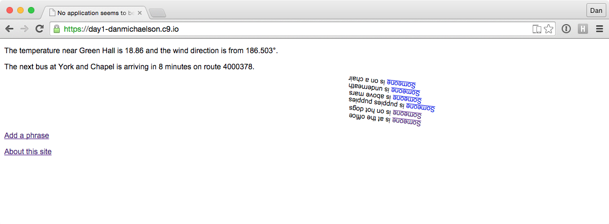

This project is a content management system that manages "phrases":
documents that each have a preposition and a noun, such as "on" (preposition) and "the chair" (noun).

In addition, it gets the weather near Green Hall every 5 minutes, and Yale Shuttle bus arrivals
at Chapel and York every 1 minute. When displaying the phrases, it presents them rotated according
to the wind direction, and indented according to the wait for the next bus.

!

## Cloning this project in Cloud9

Go to your Cloud9 dashboard and do "Create New Workspace".  
Choose "Clone From URL".  
Enter as the URL: `git@github.com:yaleinteractive/networks-demo.git`

A project called `networks-demo` will be created in your workspace. Edit it. It will have all the files from this GitHub repo.

This GitHub repo will be updated each week with the code from our class. You can clone it each time to get the latest updates into a new project in your Cloud9 dashboard.

## Running this project

1. In Cloud9, the first time you start the workspace, find a Terminal ("bash") tab and type:
`./mongod`
(and press return).
This will start the MongoDB database server. You only need to do this once per workspace.
It should remain running forever after that (even if you log out and log in from your browser etc.).

> If you can't find a Terminal ("bash") tab, try pressing Ctrl-Esc to show the console tabs.
> If necessary, you can create a new Terminal tab there by pressing "+" in the console tabs.

2. In Cloud9, double click `app.js` and then click "Run". Once the server starts, 
in the console you'll see a preview link. Click or copy this to access the web server.

> If you see an error about `Server.connect` in the `app.js` console when you try to run `app.js`, you probably
> need to run `./mongod` as described above.

3. Go to / in the preview web server to see the empty CMS.

## Editing this project

You will generally *not* edit `app.js`. That file just contains some setup code and configuration options.

Instead, edit `routes/index.js` and `feeds.js`.

Templates go in the `views` folder. Templates use the Handlebars templating language.

Static files such as images and stylesheets go in the `public` folder.

## Next steps

Modify `routes/index.js`. Define one or more models (data structures) of your own at the top.
These needn't be visual. They could contain text or numeric data instead of data that describes shapes.

Add code or additional routes within `index.js`, to create your content management system. You will
probaby need one or more display pages for each model, and pages that let users add data for each model.
You may want to define multiple different models (data types), not just one.

The code to get the weather and bus data has been separated into `feeds.js`. The feeds are then available
in `index.js` within the `feeds` object.

You can add your own feeds in `feeds.js`, such as other API's from Mashape.

Optimally, sign up for a free or paid account on [Mashape](https://www.mashape.com/) using your GitHub
credentials. Then, use your own API key at the top of `feeds.js`, instead of mine.

Modify or add HTML templates in the `views` folder, such as `home.hbs`.

These can include embedded variables passed from your router.

(Technically the templates use the [Handlebars](http://handlebarsjs.com/) templating syntax for the embedded variables.)

Put static files such as images in the `public` folder. These will be served without any processing. See example
in `views/about.hbs` (using `` to request an image from the `public` folder). 
`views/layout.hbs` also accesses a stylesheet from the `public` folder.
